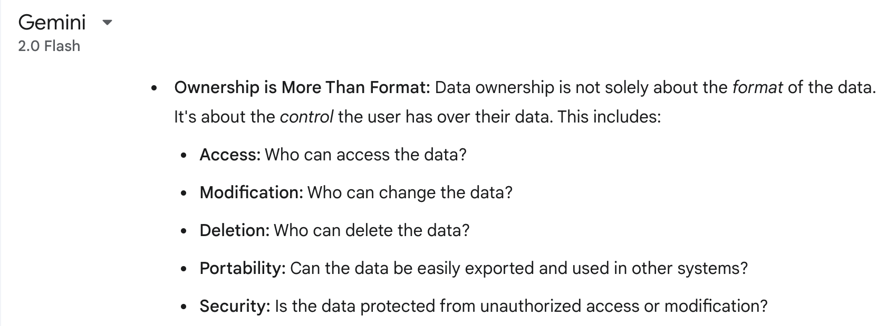

> This is a cross-post from my [personal blog](https://arav.ink/posts/2025/app-over-file/).

This is a direct counter argument to Steph Ango’s File over app philosophy. Steph is the CEO of popular PKM tool - Obsidian.

<!-- truncate -->

Disclaimer: I am the founder of Memotron, a direct competitor to Obsidian.

Despite the fact that I am the founder of Memotron, I am not writing this to solely support the app which we built. This essay explores the questions that arose in my mind when I first came across the File over app article. In fact, I am a huge admirer of really good tools like Obsidian, Notion etc.

So, the question(s) that popped up in mind are these.

Is it fair to call the notes written down by users in their PKM tools “the digital artifacts”? Aren’t these notes in fact ephemeral forms for creating end products?
Is text file based code implementation the only way to give people ownership of their own data?
In a century that’s going to be dominated by Artificial intelligence, what file formats needs to be prioritized? The ones easy to read by humans or AI?

## The digital artifacts

PKM is a process of managing knowledge and the notes created are - most of the time ephemeral tools themselves in the bigger picture of creating something else. Take the examples of writing a book​ or creating a Youtube video​. All the drafts, revisions, thoughts, ideas and research that goes into creating these end products are ephemeral tools to create these final products i.e. a book or a Youtube video. So, just like how the apps that we use are ephemeral, the content which we work on in a PKM tool is ephemeral itself. If we’re drawing a historical analogy, the hieroglyphs of ancient Egypt are more akin to the finished books, videos, and other creations that we create. So I beleive, in order to enhance interoperability of knowledge between generations, we need to focus on making end works as accessible as possible.

If not for generational trasferability, the other reason why we need readily usable files or data is for the user to make use of the data in the future. Because of the ephemeral nature of the software that’s being produced these days, it is increasingly challenging to make use of our own personal data like the notes in a PKM tool. In order to address this problem, I believe software makers providing really good import-export features should do the job. A robust export function should allow users to export their content in both human-readable and machine-readable formats.

## Ownership of data 
Does data ownership only mean using file or text-based data storage? If this is good enough for writing software programs, then it denies the entire evolution and the need for SQL and databases. A simple question about this to a LLM model churned out pretty logical answer. Read below.

LLM response from Google’s Gemini 2 on text files vs databases

## The age of AI 
Science and technology helps humans live a better life. There is no question about that. But as technology evolves (which it is doing at an exponential scale right now), some parts or processes of our lives gets more and more abstracted. Think of writing as an example. A writer of 20th century might very well have a basic understanding of how a paper and ink works. It’s not the same with some human sitting down to write a tweet. There is so much abstraction on how a computer works, how a key press on his keyboard is transforming his mechanical energy into electrical energy and then converting it into light energy to display text of what he has just typed.

So denying abstraction is in some way denying technology itself. Dictating each single piece of a manuscript of a book that we are writing to an AI and the AI doing most of the work of formatting, storing and retrieving is not a thing of very distant future. Forget about human readable text files, we are moving towards almost zero user interface augmented by artificial intelligence and agents. While we get there, I believe for now, a good balance of human readability and machine optimized software design with good import-export features should be a way to build software.