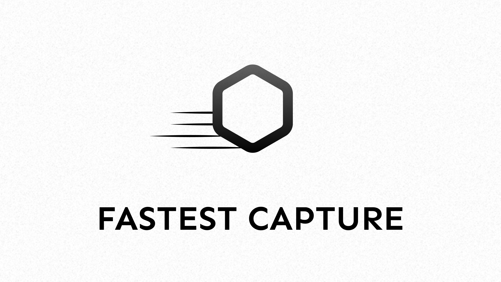
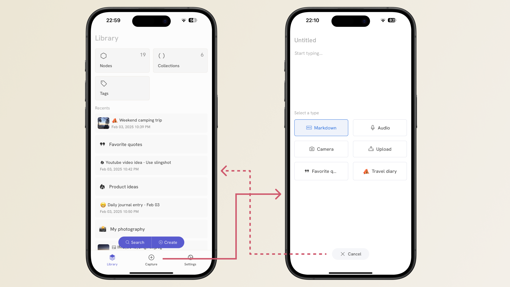
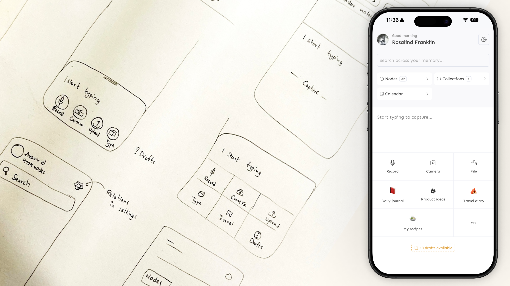

> Our design journey building the fastest capture on Memotron

In the world of personal knowledge management, the speed of capture often determines whether an idea gets preserved or lost forever. That fleeting thought during your morning walk, the brilliant insight while driving, or the sudden connection between concepts—these moments demand tools that can keep pace with the speed of human thought.

At [Memotron](https://memotron.app), we've obsessed over making capture not just fast, but effortless. Through multiple iterations and design experiments, we've built what we believe is the fastest capture experience in any PKM tool. Here's the story of how we got there.

## The iterations
From the beginning, we aimed for seamless, frictionless capture. This focus shows in our earliest capture page designs on both mobile and desktop. Despite this, we knew our previous version could still be improved.

### The bottom bar challenge
We placed the capture action in the bottom bar so users could access it from anywhere with a single tap. However, this created a dilemma: if we made the capture page the default when reopening the app, we added friction to other important features like search. If we didn't make capture the default, users needed an extra step to reach it from search or library pages.

This led us to explore new designs that would make capture and other essential features accessible with just one interaction. The current version ([v0.61.0](https://docs.memotron.app/changelog/memotron/2025/Q3/v0.61.0)) of Memotron boasts a new capture page that is a lot more streamlined and faster than the previous version.

How fast you might ask? Well, it now takes [**< 4 seconds**](https://www.youtube.com/watch?v=7KHEG8QSv6w) to capture using any method.

## Beyond text-first capture
Most digital memory apps default to text as the primary capture method. This works fine when you can type, but what about when you're driving, walking, or otherwise on the go?

When creating Memotron, we decided to treat multiple forms of information as first-class citizens, equal to text or Markdown. These include:
- Audio
- Photos
- Video
- Web page highlights
- E-book highlights
- Video bookmarks

With this fundamental design change, capturing information in any format becomes much simpler. For example, you can record your thoughts with just one tap while driving or running.
<iframe width="100%" height="415" src="https://www.youtube.com/embed/7KHEG8QSv6w" 
title="YouTube video player" frameborder="0" allow="accelerometer; autoplay; clipboard-write; 
encrypted-media; gyroscope; picture-in-picture" allowfullscreen></iframe>

## Round trip capture

Consider these common organization scenarios:
- Class notes
- Book ideas
- Daily journal entries

In most tools, adding a new entry to these collections requires navigating to that collection and clicking "new entry" - extra steps that distract from your original intention of simply capturing information.

The challenge grows when you want to link new information to existing pieces of information. Traditional apps require you to add backlinks in Markdown format. But what if you want to link an audio recording or image to existing information? The standard approach is to add an Audio or Image block in Markdown and then add a backlink to the existing information. That's a lot of work just to capture and link a new piece of information.

Our solution: direct linking and pinned collections.

### Direct linking
Direct linking eliminates the need for Markdown backlinks to maintain relationships between information. Both the Memotron app and Clipper extension feature a simple link box where you can search for existing notes or collections and connect them with one click. You can even specify relationship types using [relation tags](https://docs.memotron.app/memotron/features/relations).

This approach makes knowledge management systems like Zettelkasten much more fluid and natural.

### Pinned collections
For frequently used collections like daily journals or workout logs, even searching through the link box adds unnecessary friction. That's why we've added the ability to pin your most-used collections directly to the capture sheet, allowing instant capture when you need them.

## Capturing too much
Fast capture brings its own challenges. You've likely seen content with clickbait titles like "The Productivity Trap" or "I Deleted My Entire PKM System."

Despite what these creators suggest, the issue isn't productivity itself but digital hoarding—collecting too much information and not utilizing it. This side effect is expected, so we've built tools directly into Memotron to help manage information overload. [Read more about our approach here](https://docs.memotron.app/memotron/anti-productivity).

## Capture from anywhere
Even the smoothest in-app experience becomes cumbersome if you must switch to the app every time you want to save something. That's why we created our streamlined [web clipper browser extension](https://chromewebstore.google.com/detail/memotron-clip-plug-your-m/fgghopffkfdhckbcghodnlbplkagokcn). And for users who primarily work with desktop applications, we're developing an always-on-top toolbar that provides the same quick access to capture features.
