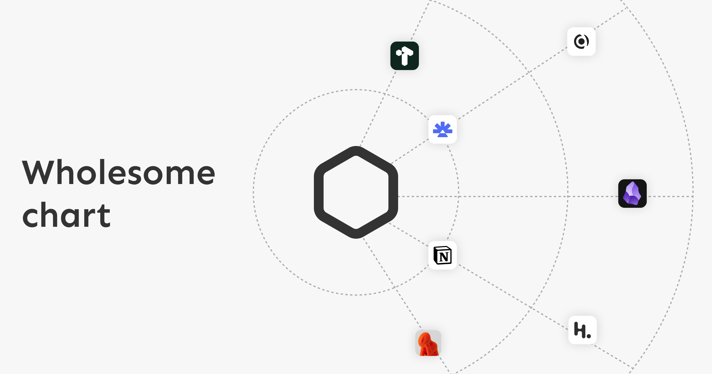
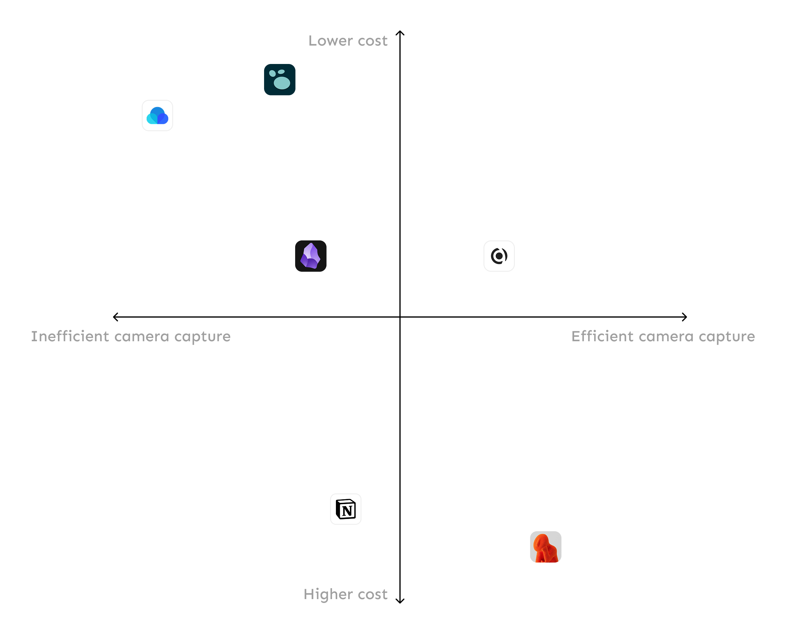
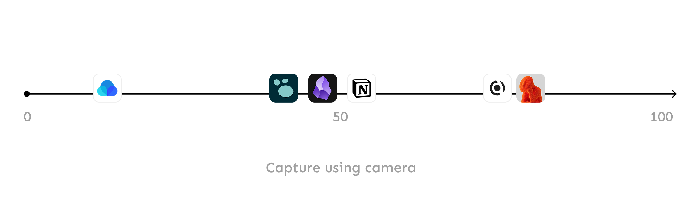
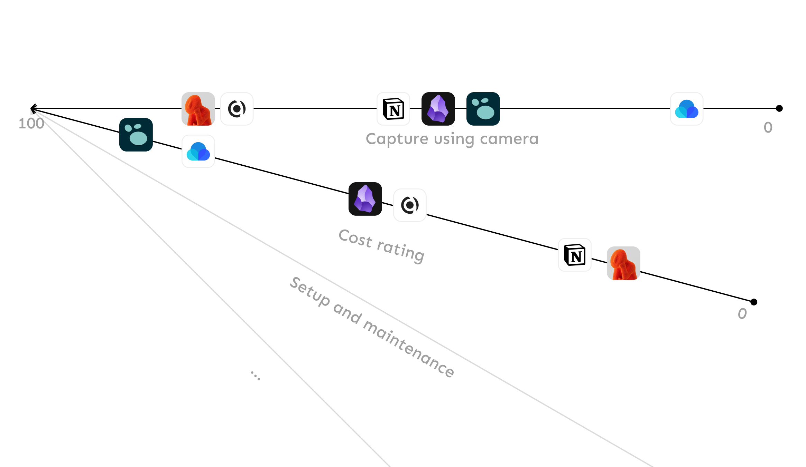
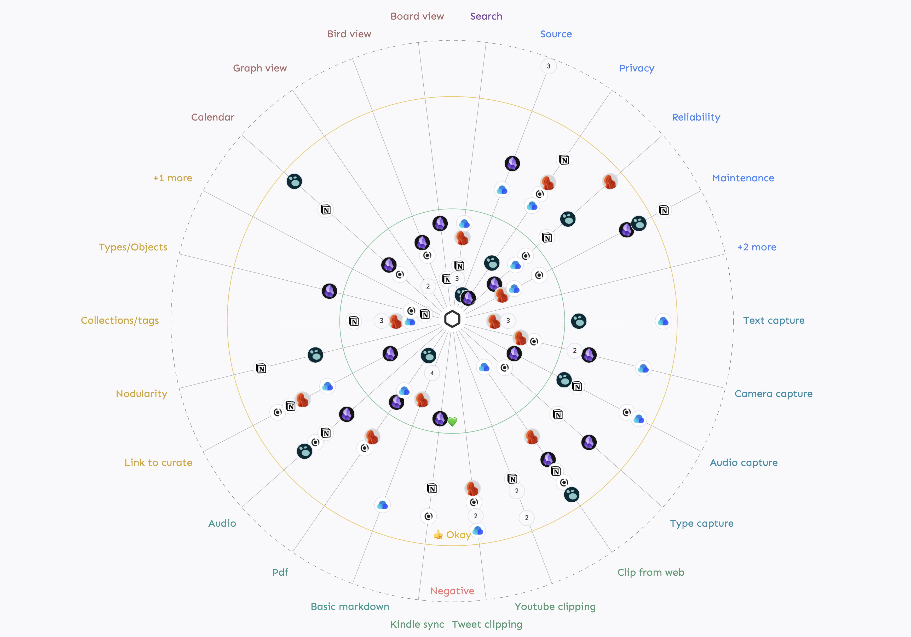
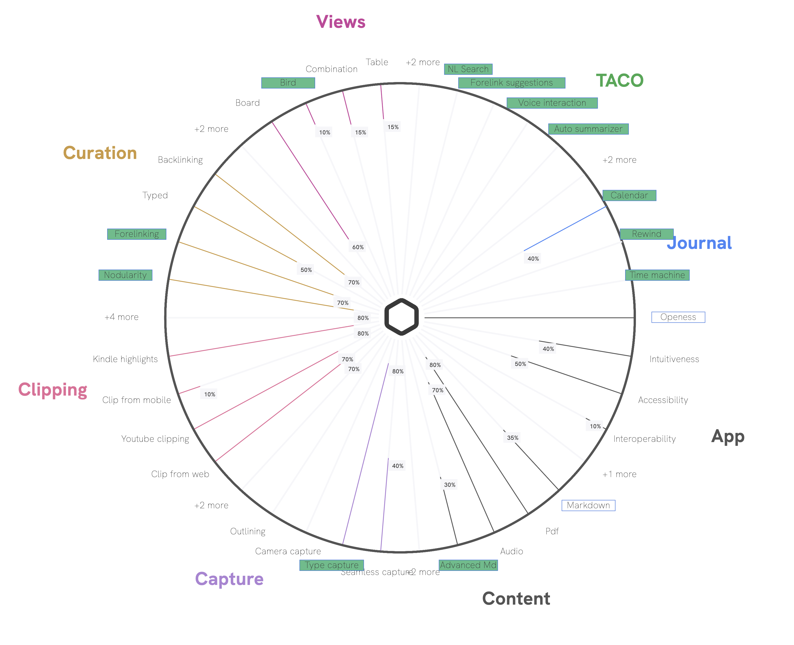

What do you usually do when you come across a promising new piece of software?

I usually look for a quick YouTube review or bookmark the site for later. YouTube comparison videos help explain features and how they stack up against existing solutions.
Either way, trying new software takes time—both to test it and to decide whether it fits into our day-to-day routine.

Default comparison pages on software websites are narrow and limited. They’re mainly written for SEO and typically compare the product to a single competitor at a time.
The only deviation among all the thousands of product websites I’ve visited is Beehiiv’s [product comparison page](https://www.beehiiv.com/comparisons). 
Even this compares only four products at a time using a carousel.

Existing attempts to solve this problem often rely on a truckload of feature lists, tables, and text. Or you might have seen a chart that maps two features on a 2D axis for visual comparison like the one below.

But this chart also has limitations: it compares only two features at a time and this is used mainly for VC pitch decks.

The wholesome chart is our attempt to solve this. Here’s how it works.

## What is a wholesome chart?

To understand the wholesome chart, imagine comparing features of a PKM (Personal Knowledge Management) app. 
Consider the diagram below: a single feature mapped to a single axis, rated from 0 (worst) on the left to 100 (best) on the right.

We rate each product for that feature on a 0–100 scale. This makes it easy to compare multiple products along a single feature.

Now, let’s reverse the axis direction, add another axis (another important feature), and arrange the axes as spokes of a wheel—keeping 100 at the center.

With this approach, we can add as many spokes as we want and compare many products across many features. **The product closest to the center on all axes is the best fit.**

We call this the `wholesome chart`: a wheel whose spokes represent features. It visualizes a product’s core capabilities and places comparable products along each feature axis for quick comparison. It makes it easy to see overlap and differentiation at a glance.

Try the interactive chart: [Memotron compare](https://memotron.app/compare)

## The origin story
I am the founder of [21n](https://21n.org) and we are currently on a mission to build super and wholesome software. Contrary to what you might think, we didn’t create the wholesome chart for a marketing comparison page. We invented it early in our product-building process. As we set out to build products with many features and sub-features, we needed a way to track progress in each area. That’s how the wholesome wheel chart came to be.

Similar to the comparison wheel, we mapped features to each spoke. In this mode, the spokes act as progress bars, and we color them to mark progress.

Above is a snapshot of the wheel’s Progress mode, which we used internally to track progress across areas. You can access a version of the chart with multiple modes from an October 2024 deployment [here](https://d3b2ase6s9uuba.cloudfront.net/fw)

That's all for now. Happy comparing!