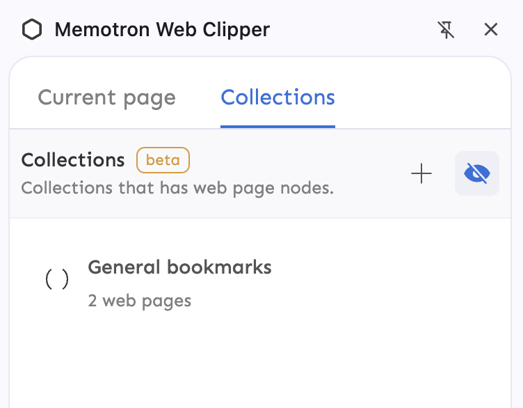

*June 21, 2025*

### Collections in clipper
- This update brings collections to Clipper side panel. Use collections to quickly open previously saved web pages, tweets, youtube videos etc.
- This is a drop-in replacement for scattered bookmarks across sites like Twitter bookmarks, Youtube saved playlists, saved web pages on browser bookmarks bar etc. right in the browser.
- This eliminates the need to open Memotron app every time the user want to open previously saved web pages.
- Incremental improvements on this feature will be available in the next few updates.
  

---
- New shortcut to activate link box on saving to use keyboard entirely to save and link. Set your shortcut to activate link box by going to `chrome://extensions/shortcuts` on your browser.
- Users can now take notes for tweets or twitter profile pages in the side panel as well which was not available earlier.
- Using save shortcut `Cmd + J` now also opens/closes the link, notes panel even after saving the web page to allow edits entirely using keyboard.
- Improved the auto close behavior of link-note toolbar panel, improved tab behavior to jump between notes and links for better keyboard usability.
- Improved web page url detection to ignore the `#` anchor and consider urls with `#` anchors as same web page
- Icon improvements in the toolbar, and twitter save button.
- Improved saving status feedback when creating a new item from link box using `Enter` key when search results were not found.
- Improved help page on clipper, added the ability to force resync if syncing didn’t happen as expected for whatever reasons.
- Improved syncing capability to sync changes that were made on the app as soon as the user visits back the web page or side panel removing the need to reload the tab or opening of a new tab. Also improved syncing user feedback on side panel.

---
## Bug fixes

- Fixed an issue where the title of youtube timestamp clip was overflowing if the title is large in the side panel
- Fixed an issue where the default shortcut for snip - `Cmd + I` was interfering with browser default italic shortcut when used from any text editor on the web. The default shortcut is now changed to `Cmd + Shift + I`
- Fixed a bug where `Cmd + J` shortcut was saving web pages when the toolbar is hidden which is not expected behavior.
- Fixed wrong placeholder message in search results for link box when `@` prefix is used.
- Fixed an issue where avatar wasn’t rendered as expected for link search results since the last Memotron app update.
- Fixed an issue where enable toolbar action was not showing in side panel at some times when the toolbar was hidden.
- Fixed notes overflow issue when taking long notes on side panel, link-notes toolbar panel and inline annotation toolbar
- Fixed an issue where text clips and tweet clips weren’t showing in search results for linking on Clipper.
- Fixed an issue where linking a tweet or text clip was not showing the linked item under the link box.