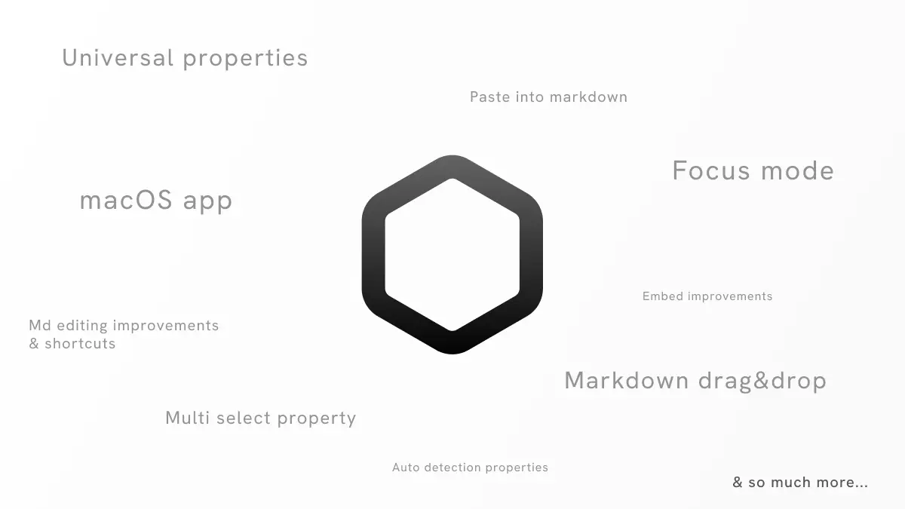
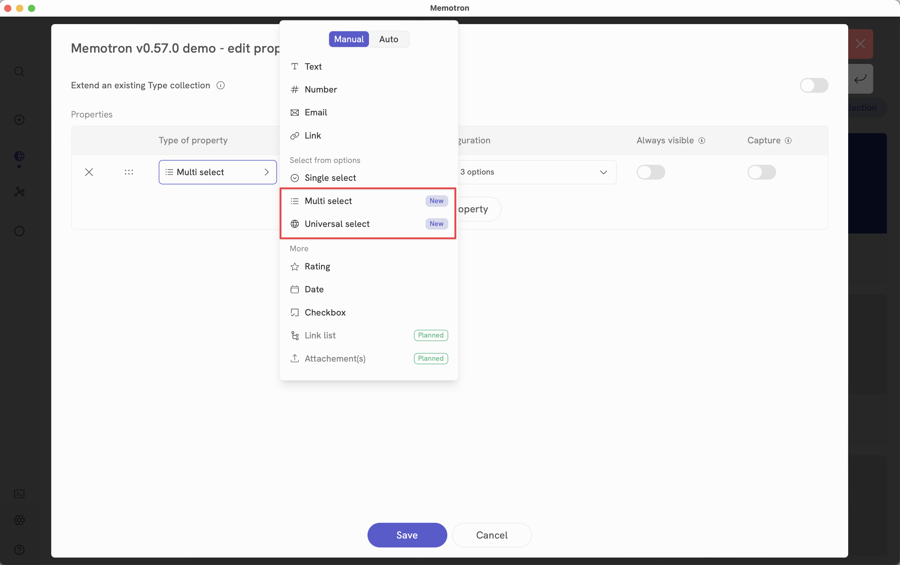
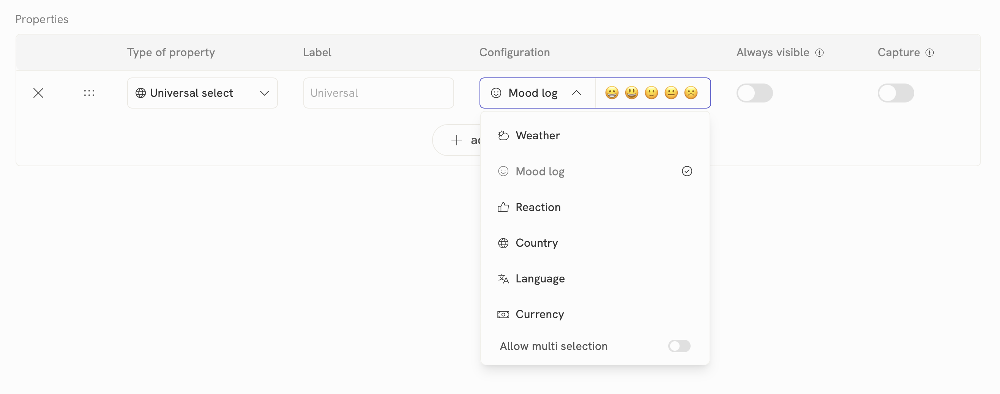
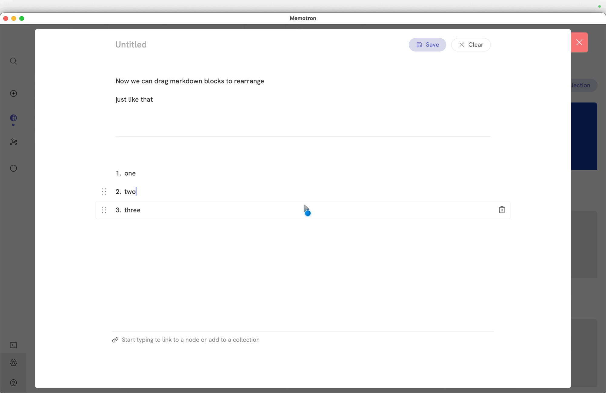
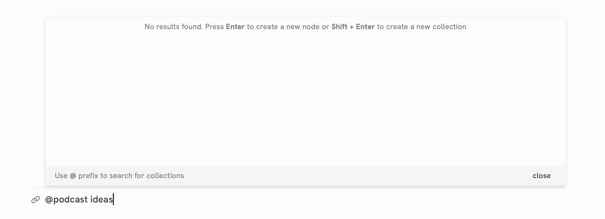

<div align="right">*Dec 31, 2024*</div>

# v0.57.0 - Desktop apps, new property types and more



### Desktop apps

Meet Memotron’s brand new macOS and Windows apps. Please install the beta apps using the links below. These apps will be available for everyone on App store and Windows store after the beta run. Please report any issues that you face on our Discord.

Apple - macOS: [https://testflight.apple.com/join/8VxCVRBH](https://testflight.apple.com/join/8VxCVRBH)

Windows - [https://apps.microsoft.com/detail/9N3W73WBXB7M](https://apps.microsoft.com/detail/9n3w73wbxb7m?hl=en-us&gl=IN&ocid=pdpshare)

---

### Properties and collection
#### Multi select property, grouping for select options



Go to properties editor and choose the newly available Multi select property for your multi select needs. Also, you can now create option groups to group a set of options together for ease of use.

### Universal properties
Creating a property is never easy than now. Universal properties are pre-defined select properties where we do all the work of pre-creating options so that you can instantly use the property without the need to define every single option.



Go to propertied editor and choose Universal select property type. Then, you can choose the sub type from among the below available universal selects.

1. Weather log

2. Mood log

3. Reaction

4. Country

5. Language

6. Currency

7. Time zone

8. Continent

### Auto detection property: Color detection

We have also added another new property type called “Color detection”. Use this to auto detect colors present in an image. More auto detections will be available soon.

### Convert a property type

Now you can seamlessly convert between property types like single select, multi select etc.

:::note

Some data will be lost if you convert between non-compatible types.

:::

### More

- Tabs and groups now shows item counts when you set Tab by or Group by setting in collection view settings.

- Properties editor now shows derived collections along with type extension.

- New System ID - system property

---

### Markdown

#### Drag and drop to rearrange

You can now drag and drop blocks in markdown to rearrange.



### Paste into markdown
- Paste single or multiple files which are copied to clipboard when markdown is active to directly insert into markdown as file embeds.

- Paste markdown text copied from other markdown apps like Notion, Obsidian etc to seamlessly copy md content from other apps.

- Paste simple text or links into markdown

### Drag into markdown

You can also drag single or multiple files into markdown to add as file embeds automatically.

### Insert into markdown via global paste, file uploader

You can also insert files or text into markdown by pasting into the app without the need to open capture.

### Embed block improvements

- Embed anything block now accepts iframe embed code generated by websites along with simple URL. Ex: ```<iframe some code />```

- Now with a single click, you can download media, redirect to external link or go to embed node

- Ability to resize external site embed blocks is added.

- Added support for embedding Github gists and Gitlab snippets

- Improved embed experience for below embeds

    - Google Maps

    - Google docs

    - Figma

    - Replit

### Shortcuts

- Quote can now be added using > along with existing shortcut " .

- Quickly add callout using ! shortcut.

- Quickly add code block using ``` shortcut

- Block browser now shows shortcut on the right for easy reference

- Use for mentioning external links inline. Example: [Google](link here)

- Mention shortcut is changed to [[ to be consistent with regular markdown patterns and also avoid conflict with external link mention

### Editing improvements

- Pressing Enter in between a sentence will now move the text on the right to next block which is a expected behavior.

- Pressing Backspace at the start of the sentence will now move the text to previous block if present.

- Pressing arrow up and arrow down keys will work more reliably as expected.

- Improved markdown saving time during capture significantly.

- Cursor caret color will show the callout color when editing the text in a callout.

- Improved markdown callout design.

- Improved code block design.

- Quick delete any block by hovering and clicking on right side delete button.

### Table of contents improvements
- Improved table of contents text sizing.

- Clicking on a heading now scrolls with more smoother animation.

- Shows active status for headings that are visible in the view and currently focusing.

- Shows tooltips if the heading text is large and truncated.

### Read-only mode, focus mode and locking a node

Markdown node now has the ability to lock, read-only mode for cleaner reading experience and locking a node to preserve the node.

---

### Linking
#### @ shortcut to filter collections when linking
When linking, you can now use @ prefix to filter collections.

#### Creating a node or collection while linking
You can now quickly create a node or a collection while searching for linking by simply pressing ```Enter``` when results were not found for the given search query.



### Other small improvements

- Ability to drag tabs to rearrange is added.

- Audio node will now display album art if present and also shows more metadata like album, title, artist, etc if present

- Image node now shows more metadata in metadata section like capture device, camera details, location etc. if available.

- Improved sync time and initial loading time.

- Expand to full width setting will now persist per node.

- Added the ability to edit profile picture and preferred name. Go to Account settings to edit these.

- Improved delete account scenarios.

    - Deleting an account from one device will logout on other devices.

    - Improved user feedback while delete in progress.

- Download option in context menu for media nodes like image, audio, pdf etc

- Fixed an UX issue where close split screen button was showing on the bottom bar instead of usual top right corner location.

- Improved user feedback for cases when backend server isn’t responding.

- Command bar improvements - same command action with multiple labels has been improved.

- Improved duplicate checks for linking, adding a node to a collection

- Improved markdown node - bottom floating bar design.

- Improved command mode of interaction.

- Ability to edit the title of a media node by simply clicking on the title in the bottom bar.

- Other small improvements

### Bug fixes
- Fixed an issue where embedding an image or audio node etc is not adding a mention backlink.

- Fixed an issue where mentions are not showing when a heading is focused.

- Fixed an issue where the app was flickering continuously when the login session was expired.

- Fixed a bug where the right side controls are not visible on markdown node when the node is expanded to full width and contains full length paragraph blocks.

- Fixed title of web page node was not editable after clicking edit.

- Fixed an issue where webpage embed was not saving properly

### Suspension notice

We have temporarily suspended Semantic search capability and we will reintroduce it after making necessary changes. Provided below are the details on why we made this decision.

Currently, for semantic search to work, the app generates vector embeddings and stores them on user’s database. This is fine if you are a offline user. But for cloud sync version, to achieve occasional full offline capability, the app currently copies the entire database to user’s device on first login from remote server. Then it subsequently syncs changes made on other devices. As vector embeddings are huge in size, this is causing significant latency issues during sync. Therefore, we are experimenting a possible solution to keep some data heavy features like semantic search, access history, time-series data etc as cloud only features so that we don’t have to sync or full clone on each user device.

:::note

Full offline users will still have access to all these features. The only difference is cloud sync users will no longer be able to use certain features like Semantic search, history etc without connecting to the internet.

:::


