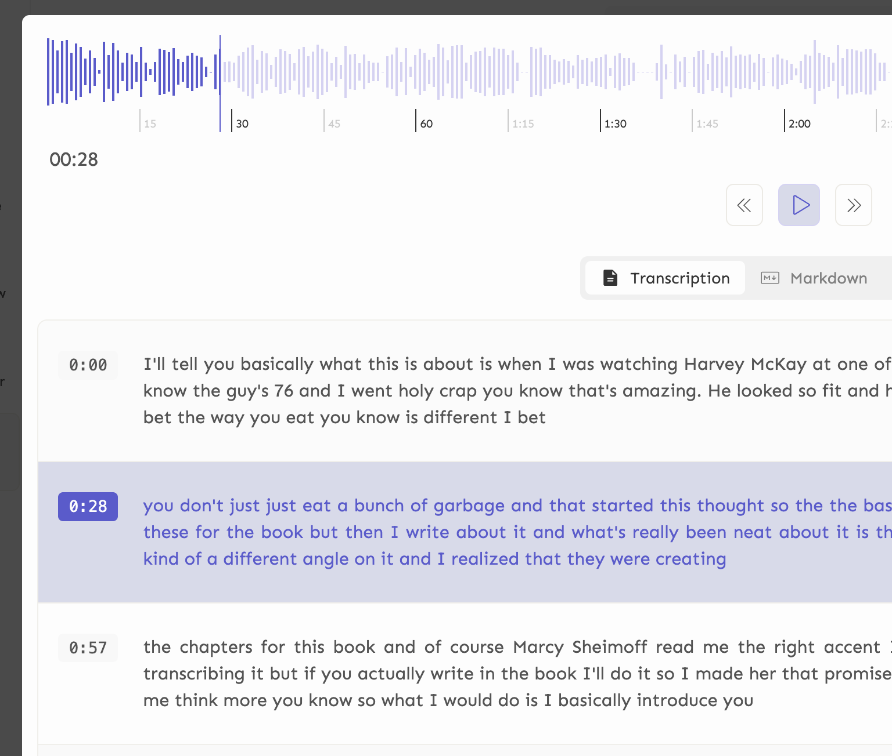
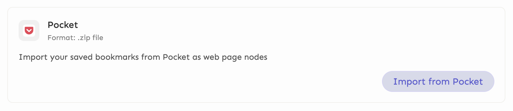
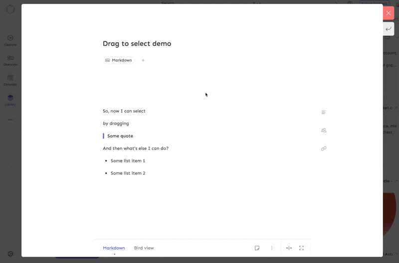
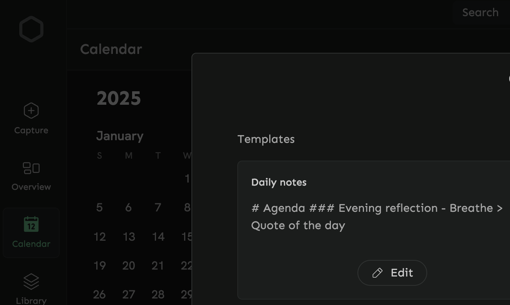

*July 08, 2025*

# v0.60.0 - Audio transcription reintroduction & more
> Rolling out now

### Audio transcription is back
With this update, we are reintroducing audio transcription feature. A while ago, we removed this feature in favor of more performant implementation and to avoid crash issues that were happening on iOS and macOS devices. The new implementation is more stable and performant.

This update rolls out transcription to iOS devices.

- More performant and stable transcription. Note: The first transcription might take a bit longer to complete due to the setup and download of the model involved.
- Added timestamps to the transcription.
- Added a new option to the auto-transcribe on record for faster transcription.
- Other language support, speaker detection, and macOS implementation will be available in subsequent releases.

### Import from Pocket
Its time to move on from [Pocket](https://support.mozilla.org/en-US/kb/future-of-pocket). With this release, we have added an ability to import the Pocket exported `.zip` file. With one single click, all bookmarks, collections, tags, annotations will be imported into Memotron.

_Quick guide to import your Pocket data:_

**Step 1:** Export your Pocket data by visiting [Pocket Export](https://getpocket.com/export). The ability to export will be terminated on Oct 08, 2025 - according to the [shut down article](https://support.mozilla.org/en-US/kb/future-of-pocket).

**Step 2:** You will receive an email with a link to download the `.zip` file.

**Step 3:** Open Memotron and go to the settings -> Data settings -> Import from other apps. Or search for `Import from other apps` in the command bar.

**Step 4:** Upload the `.zip` file and click on the import button.

### Drag to select
Added the ability to bulk select by dragging. This is available in the following places:
- Markdown: to select multiple blocks at a time - for rearranging, copying, deleting, etc.
- Library, pinned resource pages: to select multiple items at a time - for bulk operations.

### Calendar notes templates
Added a new feature to create and resuse template for daily notes. This is a fantastic way to quickly jot down your daily notes without the need to duplicate the same content every day.

To edit the template, go to Calendar -> Click on settings on the top right corner -> Choose Daily notes template.

### More
- Universal select property now has days of the week, months of the year options
- For universal select property with too many options like language, country etc - recently used options will now show on the top to make it easier to select
- Added a new traverse option in Node bird view -> Graph. When traverse is turned on - clicking on a node in the graph view will open further links of the clicked node instead of opening the clicked node markdown page.
- Other small improvements

## Bug fixes
- Fixed a bug where creating a new single select property and then switching to universal select property and then switching back again to single select property would cause the property options to crash.
- Fixed an issue where creating a new collection with type extension and then creating another collection from link search results immediately would cause the new collection to use the old type extension configuration despite not explicitly setting it.
- Fix a bug where changing typeface was not working.