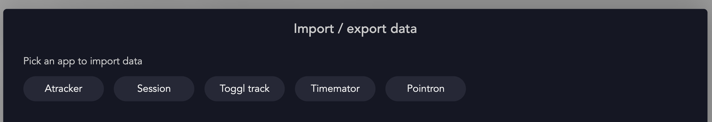
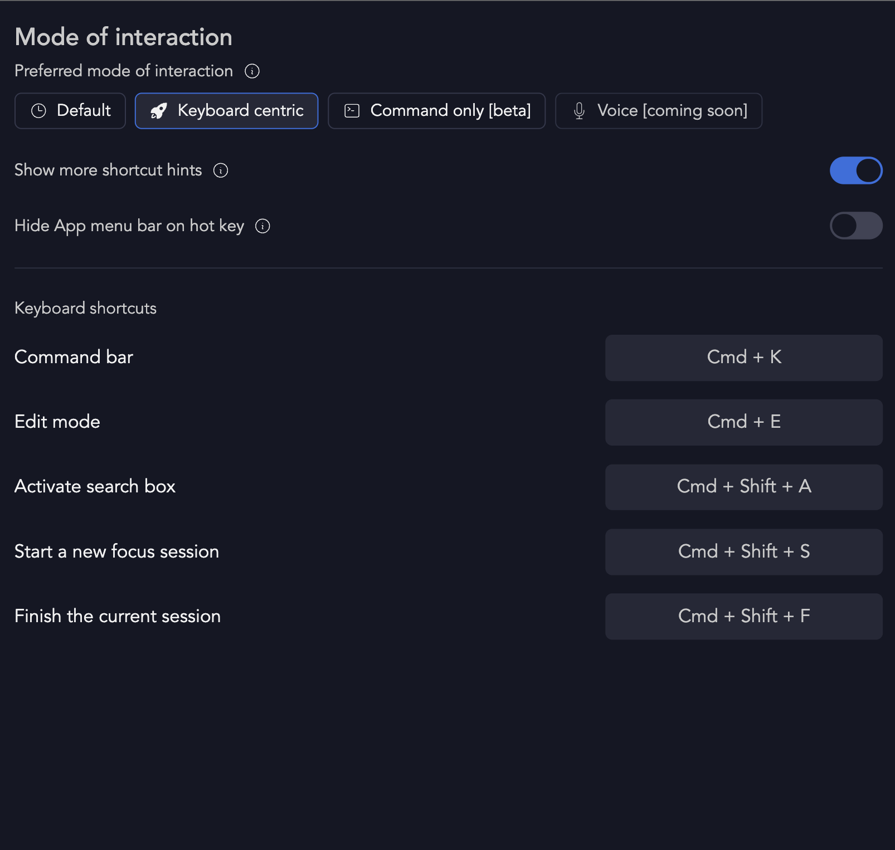
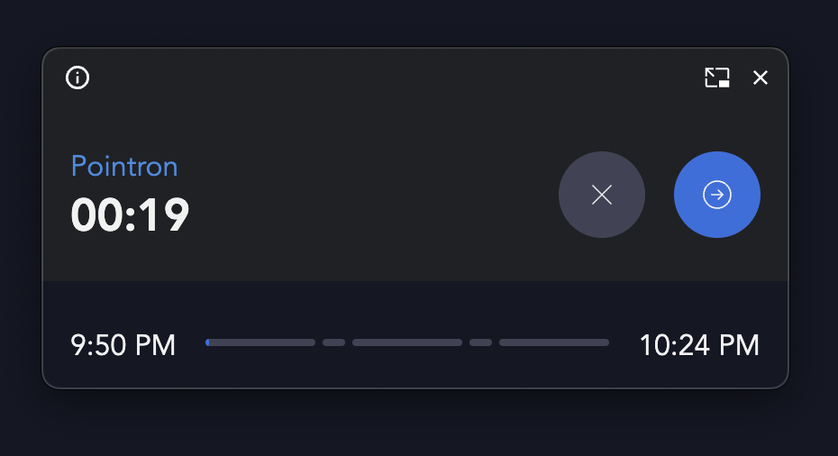

*Aug 27, 2024*

> This release brings performance improvements, new feature to import historical time tracking data from other apps and many other bug fixes to make the app smoother, performant and better than ever before.

Here are the list of all major features released in this version:

### 🎆 Import from other time tracking apps
Users can now import their historical time tracking data if the user used any of the time tracking apps earlier. The apps include Atracker, Toggl track, Session and Timemator.

### 🔥 Performance improvements
We have improved the app loading time and database querying latency with some architectural changes to our backend system. The initial loading time of the app should now be reduced significantly and any new users will be presented with an option to choose their closest region for data hosting.

### 🚀 Mode of interaction settings and command only mode
We have introduced a brand new setting called "Mode of interaction". This dramatically changes the way a user interacts with the application.

With this setting, user can choose between:

**Default mode**: For those who like their apps traditional and mouse-friendly. This is a combination of all modes where the user can still use hot keys, keyboard shortcuts and Command bar. But, none of those will come in the way to enable more visual experience.

**Keyboard centric**: Unleash the power of hotkeys and leave your mouse in the dust.

**Command only mode**: For the ultimate power user who wants to control Pointron like a coding maestro.

To use this setting - Go to Settings and choose Mode of interaction or search for Mode of Interaction from Command bar.

### 🎨 Redesigned Picture in picture on web app

*Witness the glitter for yourself!*

# Other

- Ability to edit analytics page from mobile app
- Ability to create a new goal while searching for a focus item - from focus items.
- Two refreshing dark themes - Lime and Oxide
- Improved and highly performant - Google sign in on iOS app.
- Users can now select absolute time in Analytics care when selecting the time period for the card.
- Improvements on how the focus interval bars look when there are too many intervals.
- Focus session - reliability improvements for Pomodoro type session
- Ability to select go back and select a previous year on Journal heatmap
- Focus now action from a goal page to quickly focus from a specific goal page
- Lifetime so far card on goal page to show the entire focus time for a selected goal
- Improvements on how the analytics cards and charts looks in edit mode
- Critical bug fixes on Area chart and Line charts
- Ability to remove and add goals to Quick focus with a direct edit action.
- Selecting a tag on quick focus section will now persists the state of the selection.
- Critical bug fixes to duration input which is used to enter countdown duration, break duration etc
- Many other smaller bug fixes and tiny improvements to make the app run smoother, faster and better.
