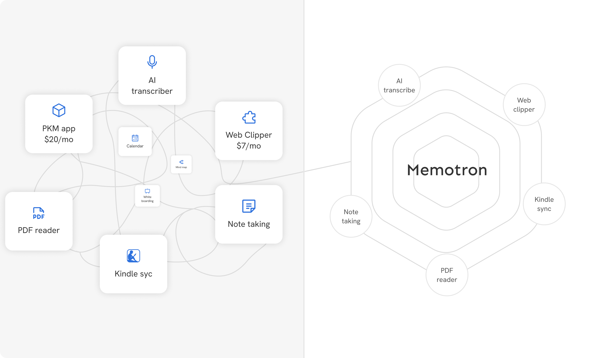

import FeatureCards from '@site/src/components/FeatureCards';

<!--MEMOTRON_START-->

# Introduction
> Memotron - our thoughtfully crafted tool for your memory and thinking assistance.

Throughout history, great thinkers and innovators have relied on external tools to support their thought processes and navigate the complex world of ideas. From Leonardo da Vinci's notebooks to Marie Curie's journals, these aids have been crucial in extending our cognitive abilities beyond biological memory.

In our age of unprecedented information access and potential for intellectual growth, digital memory tools have become invaluable. **Memotron** is a super app that offers a **holistic and intuitive** approach to research, learning and thinking. Memotron seamlessly integrates into your daily lives, providing a powerful external memory aid. It supports cognitive processes, enhances creativity, promotes personal growth, and contributes to overall well-being.

To put it into a single sentence, Memotron is an unbelievably powerful, insanely reliable, and surprisingly intuitive digital atlas for your memory.

## Why Memotron?

Memotron isn't just another digital organizer or a PKM tool. We consciously crafted it keeping all our digital lives and workflows in mind. Read our [NCCL system](/memotron/core) to dive deeper into our design decisions and architecture.

Memotron eliminates the need for you to constantly jump back and forth between different devices or applications. Say goodbye to shallow and siloed apps in favor of a wholesome experience. You can easily **replace 10+ apps and save ~ $100 a month** in subscription fees.

You can quickly compare Memotron with other apps [here](https://memotron.app/compare).

### Key features

1. **Fastest capture ever built**: Don't take our word for it. See it for yourself [here](https://www.youtube.com/watch?v=7KHEG8QSv6w).
2. **Web clipper extension**: We built a robust web clipper extension that can…
   1. Highlight text on web pages and retain the highlights when coming back to the web page.
   2. Capture content from the web using screenshots.
   3. Bookmark video timestamps and add notes on YouTube.
   4. Save Tweets, LinkedIn posts, and other social content from major platforms. See the list [here](/memotron/web-clipper/social-clipping).
   5. Sync Kindle books and highlights with a single click.
   6. Plug your memory into AI chats and NotebookLM notebooks _(coming soon)_.
3. **Link to curate**: Organization captured information was always the challenging and most time-consuming process in knowledge management. But, not with Memotron. Memotron's direct linking and [link to curate](/memotron/core#link-to-curate) features makes organization indivisible from capture itself.
4. **Audio transcription, PDF highlighting and more**: Audio, PDF, web highlights etc are all first-class information in Memotron. This unlocks whole new possibilities of capturing and linking information.
5. **Anti-productivity**: Don't get trapped into the anti-productivity design patterns encouraged by most of the PKM tools. Read more [here](/memotron/anti-productivity) on how we combat anti-productivity proactively.
6. **Offline-first**: Memotron is a truly offline-first tool. You can use it without an internet connection and offline-only variant requires no cloud signup.

Memotron isn't just about managing information - it's a tool for reflection, personal growth, and mental well-being. By providing a space to explore your inner world, process complex feelings, and gain deeper self-understanding, Memotron supports your journey towards a more fulfilling life.

## Getting Started

Ready to enhance your cognitive capabilities and improve your quality of life? Dive into our [Quick start guide](/memotron/quickstart) section to begin your Memotron journey.

For those eager to explore further, our [Product deep dive](/memotron/core) section offer detailed insights into Memotron's potential across various scenarios.

Welcome to a new era of thinking, creating, and growing. Welcome to Memotron.

---
_Learn more about our principles here:_
<FeatureCards cards={[
  {
    title: 'Unbelievably reliable',
    description: 'Mission critical performance and bug-free experience is not an afterthought for us.',
  },
  {
    title: 'Zero-trust security and ownership',
    description: 'Your data remains yours with end-to-end encryption and complete ownership.',
  },
  {
    title: 'AI native',
    description: 'Not just the sprinkles and sparkles.',
  },
  {
    title: 'Built to last',
    description: 'No exits and no acquisitions. We are not building for an exit.',
  },
  {
    title: 'Humane by design',
    description: 'No manipulative design. No dark patterns.',
    link: '/humane-design'
  },
]} />

<!--MEMOTRON_END-->

<!--POINTRON_START-->

# Introduction

Welcome to Pointron - your focus haven for productive work 🎯 ✨

In today's fast-paced world, staying focused and productive can feel like an uphill battle. That's where Pointron comes in - a thoughtfully designed tool that helps you maintain laser-sharp focus and achieve more in less time.

1. **Distraction-free environment:** Pointron creates a serene digital workspace with advanced focusing capabilities to help you stay in the flow, making deep work not just possible, but natural.

2. **Time-aware productivity:** Understanding that time is your most valuable resource, Pointron helps you make the most of it. With features like intuitive task management, powerful ways to focus, and insightful productivity analytics, you can optimize your work patterns and achieve better results.

3. **Flexibility meets structure:** Whether you're a creative professional, knowledge worker, or student, Pointron adapts to your unique workflow. Its flexible system allows you to organize tasks and projects your way, while providing just enough structure to keep you on track.

4. **Beyond task management:** Pointron isn't just about checking off tasks - it's about fostering a sustainable and enjoyable way of working. By helping you maintain a healthy work-life balance and preventing burnout, Pointron ensures that productivity doesn't come at the cost of well-being.

Ready to transform the way you work? Dive into our [Quick start guide](/pointron/quickstart) to begin your journey with Pointron.
<!--POINTRON_END-->

<!--NUCLEUS_START-->

# Introduction

Welcome to Nucleus! While we're working on improving our docs, please navigate to next sections to dive deep into concepts of Nucleus.

<!--NUCLEUS_END-->

<!--DEFAULT_START-->
# Introduction

Welcome to our documentation

[... Default content ...]
<!--DEFAULT_END-->

*Updated on Sept 08, 2025*
