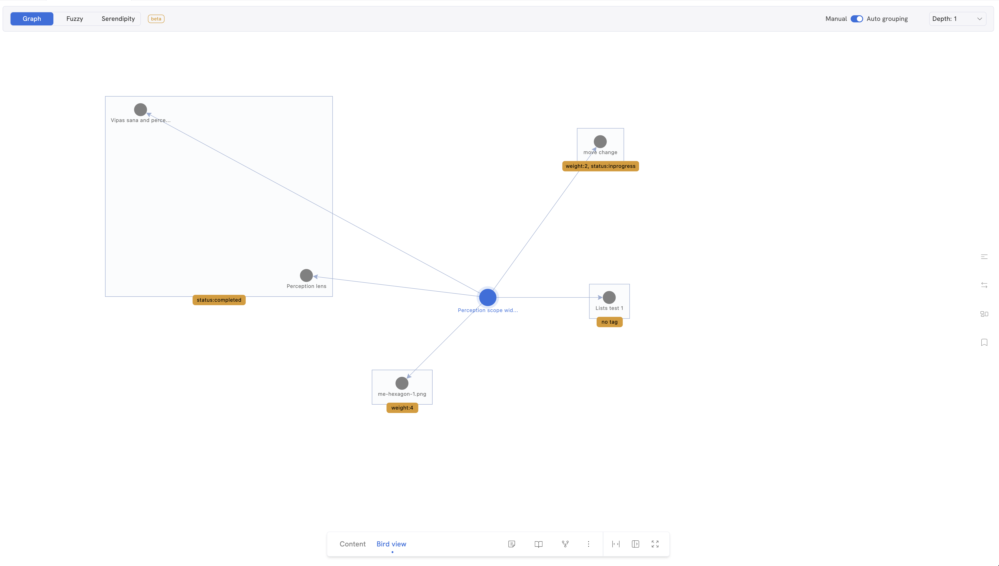

Bird’s eye view aka. Bird view is our craftsmanship for you to visually look at any resource in Memotron from a higher angle or bigger picture.

While we are still working on our proprietary ```Fuzzy sub view```, we released graph sub view for you to get a quick glance of all the connections for any given node.



Above image shows sneak peek of bird view with graph. Graph is available from ```v0.56```

*Updated on January 11, 2025, 3:48 AM UTC*
