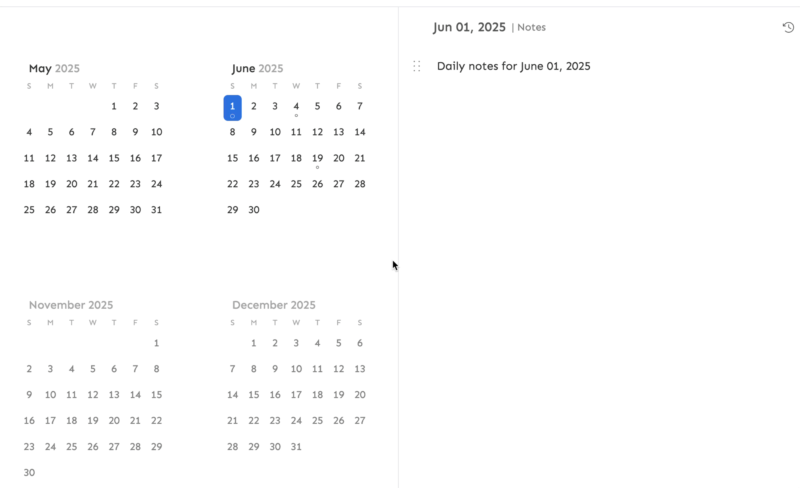

import Canonical from '@site/src/components/Canonical';

<Canonical path="/memotron/features/calendar" />

Calendar in Memotron allows you to quickly jot down your daily notes when you click on a date in month or year view.

### Monthly and Yearly notes
Alongside daily notes, you can also create monthly and yearly notes. This will super useful if you want to write high level goals or notes for a month or year.

To add monthly or yearly notes, click on `Year view` in the calendar and then click on month or year labels in the view.

### Templates
You can also create templates for daily, monthly and yearly notes. When you click on a date or month or year for the first time, this template will be used to pre-populate the markdown structure that you want to have for all your notes.

To edit templates, click on settings button on the top right corner of Calendar page.

*Updated on September 16, 2025*