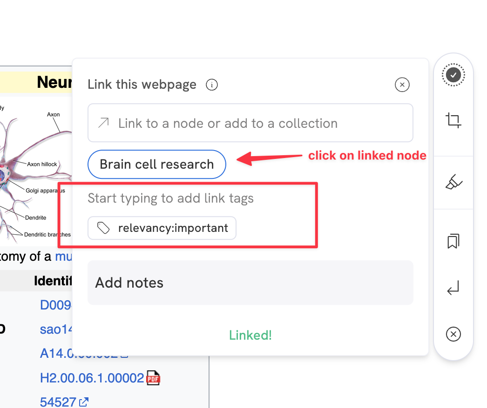
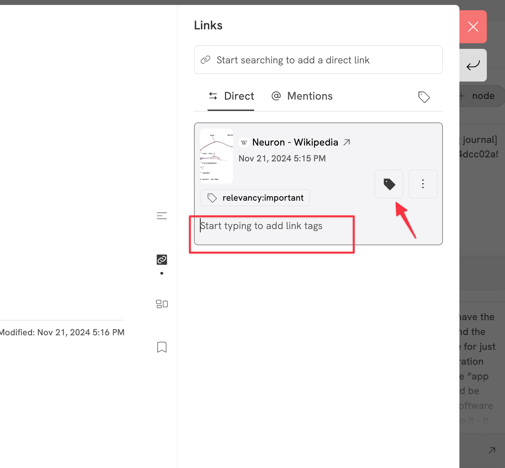
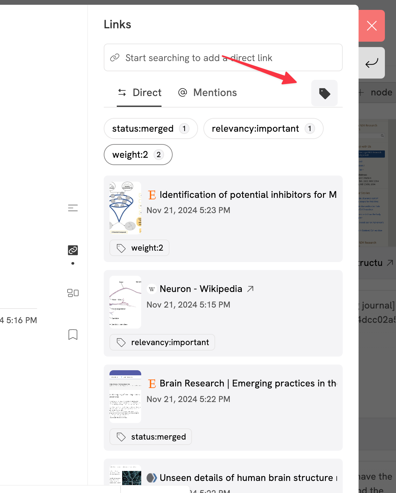
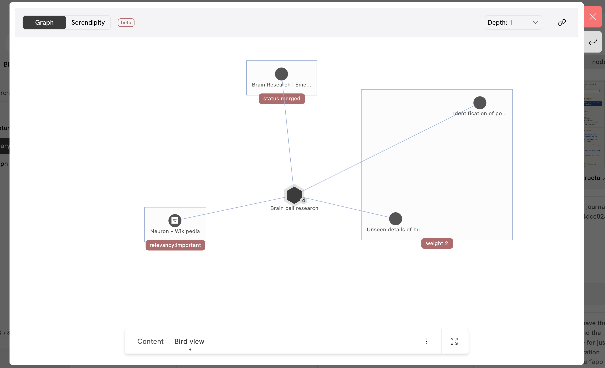

import Canonical from '@site/src/components/Canonical';

<Canonical path="/memotron/features/relations" />

> Previously known as **link tags**

Use Relations to maintain relationships for connections that you make on Memotron.

**Example:**

Imagine you are researching about a topic and you linked 50 different relevant information to it. As the information grows, coming back and utilizing the connected information can feel daunting. That’s when relations can help segregate information and utilize it efficiently when coming back to it.

Example relations include:

1. Simple relationships like ```author``` , ```duplicate``` , ```relevant```, ```1995```

2. Giving importance or weight to the connection to store the relevancy of connected information: ```relevancy:strong``` , ```relevancy:weak```, ```weight:5```, ```weight:3``` , ```important``` , ```very useful``` etc

3. Status of information incorporation like ```status:used``` , ```status:ignored```, ```status:further-research``` etc

4. To carry out analysis like SWOT, Decision matrix, Cost-benefit analysis, weighted decision matrix, etc - ```threat```, ```strength``` , ```pro```, ```con```, ```conclusive``` etc

## How to add relations?

You can add relations while clipping using the Clipper extension or from the links panel on node page.

### From clipper
Once you clip anything and add a link, click on the linked node to add relations as shown in the picture below.



### From node links panel

Simply click on the tag button and add relations.



--- 

## Utilizing relations
Once added, you can make use of relations by using them as filters in node links panel or visually grouping connections on node bird view.





*Updated on January 11, 2025, 3:48 AM UTC*
