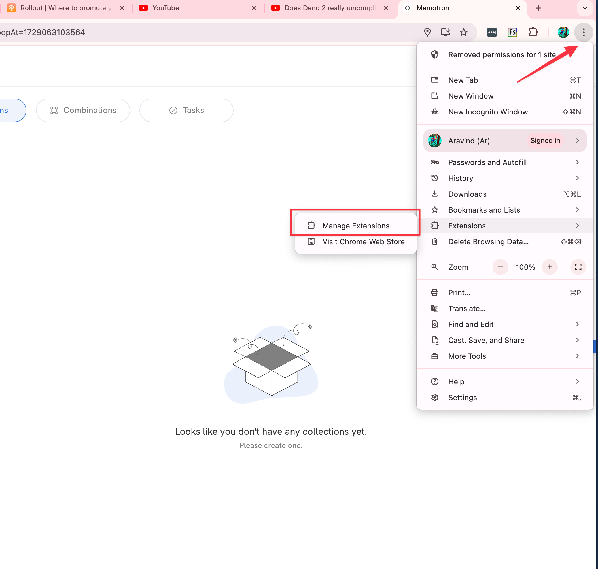
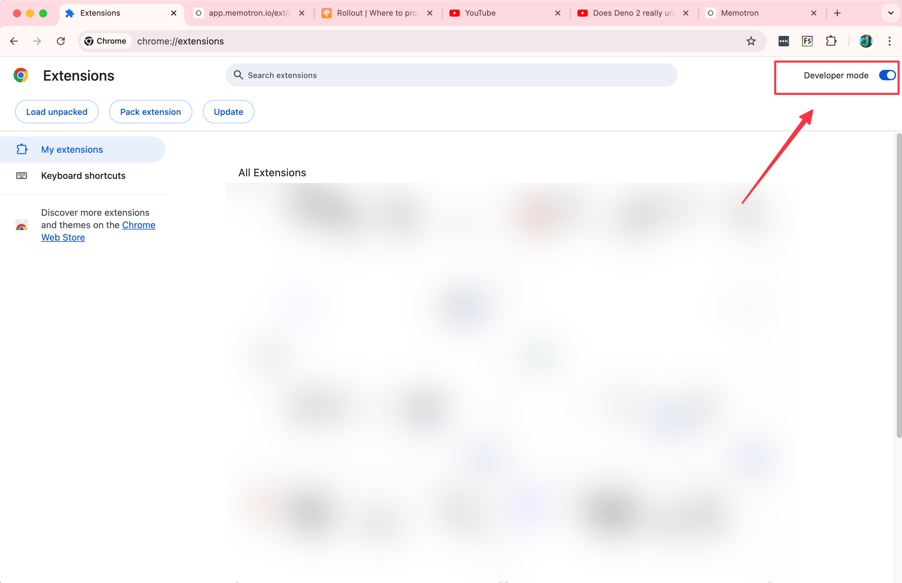

import CustomButton from '@site/src/components/CustomButton';

# Preview Apps

If you are excited about what’s coming next and would like to help us report any feedback for newer functionality, you can do so by installing our preview apps. Follow along this guide to install preview versions of our apps.

### iOS and macOS apps

<CustomButton
  color="#000" 
  url="https://testflight.apple.com/join/8VxCVRBH"
  title="Get from Apple Testflight"
  icon="AppleLogo" 
  weight="fill"
/><br/>

### Android

<CustomButton
  color="#000" 
  url="https://play.google.com/store/apps/details?id=io.memotron.app.twa&hl=en"
  title="Get from Play store"
  icon="GooglePlayLogo" 
  weight="fill"
/><br/>

---

## Chrome extension

1. Download the extension by clicking [here](../../src/images/memotron-docs/memotron-clipper-v0.56.4-build-3%20(1).zip) . (Please wait for 4-5 secs for the auto download to start)

2. Open your browser

3. Go to Extensions page on your browser, for that,

    1. Paste this URL in the address bar on the top

        1. For chrome: ```chrome://extensions```

        2. For Edge: ```edge://extensions```

    2. OR - Click on options on the top right corner, then click on,Extensions → Manage Extension



4. In the Extensions page enable Developer Mode, you can the toggle for it on the top right corner



5. Once enabled, you can drag and drop the downloaded file to the extension page.

*Updated on February 5, 2025, 3:04 AM UTC*


