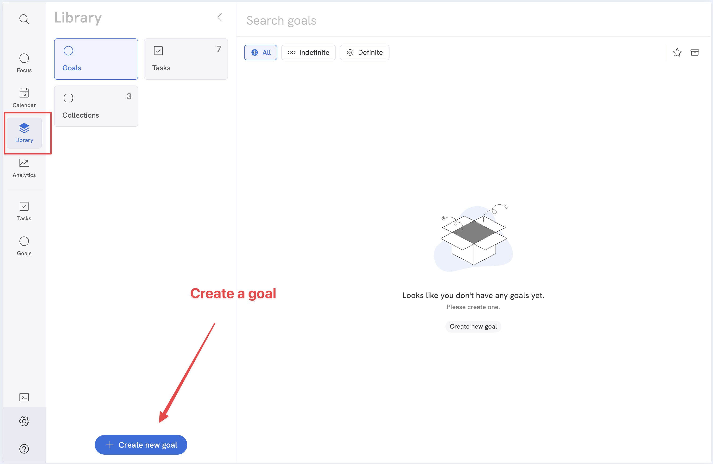
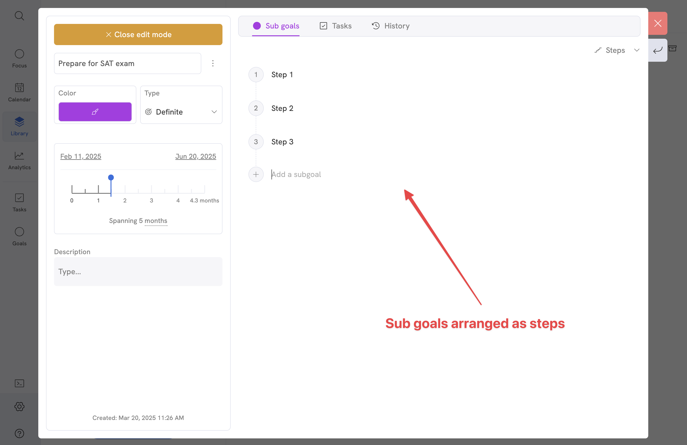
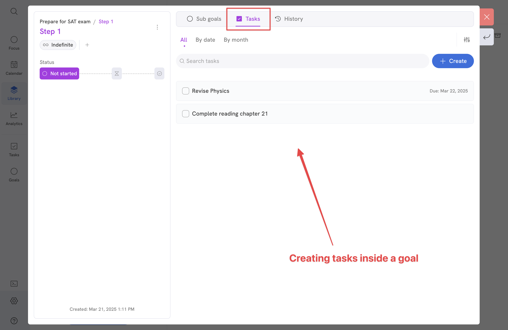
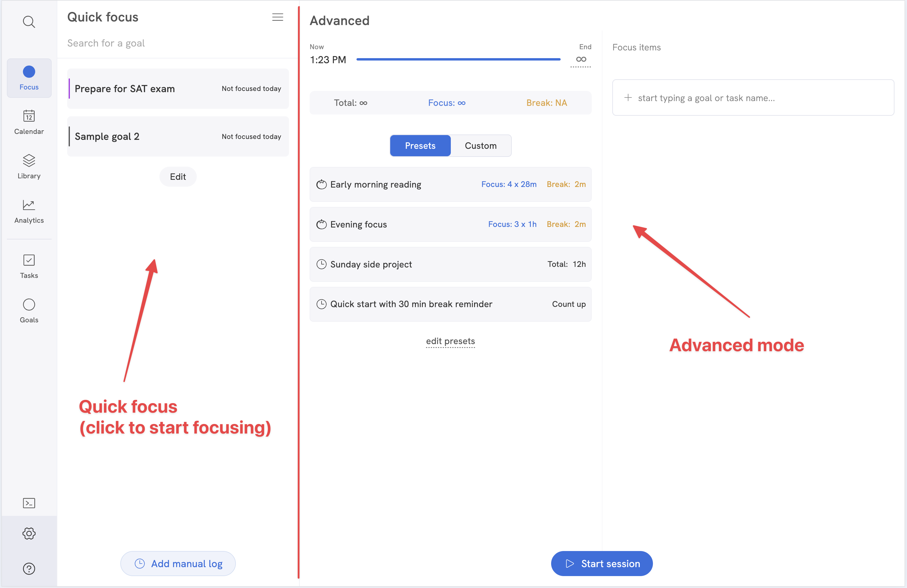
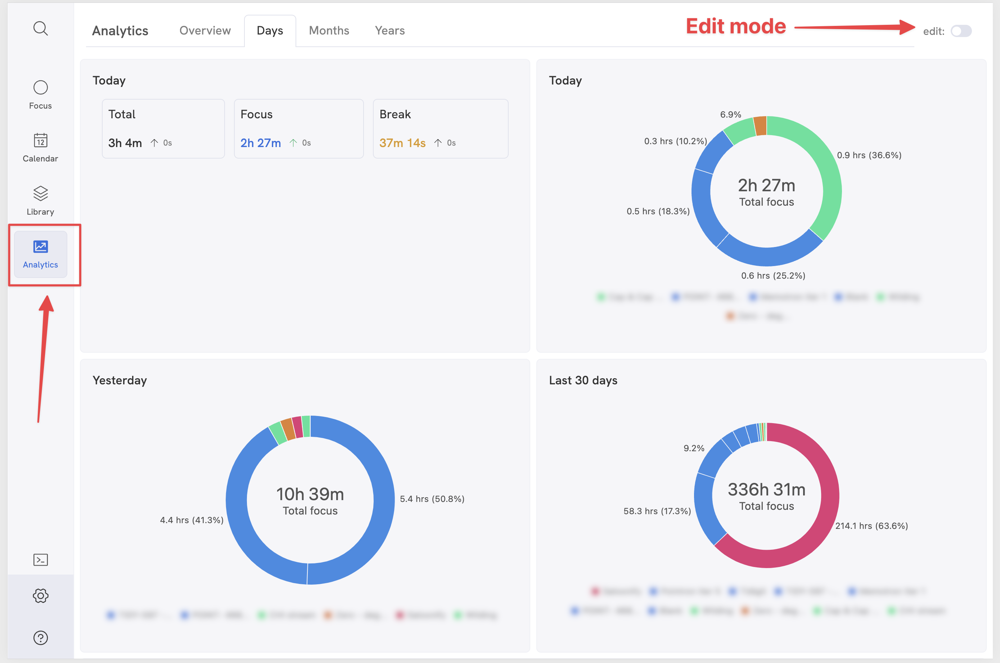

# Quick start

Pointron full tutorial (v0.82):

<iframe width="560" height="315" src="https://www.youtube.com/embed/5lnABLu3YXs?si=kulpVlxRmlhjDa0T" title="YouTube video player" frameborder="0" allow="accelerometer; autoplay; clipboard-write; encrypted-media; gyroscope; picture-in-picture; web-share" referrerpolicy="strict-origin-when-cross-origin" allowfullscreen></iframe>

---
# Step by step guide

### 1. Start by creating a new goal.
You can create a new goal by going to Library -> Goals -> Create new goal.

### 2. Create tasks and sub goals.
Depending on your requirement, create tasks or sub goals inside a goal. If the goal is large, you can create sub goals inside a goal to break it down into smaller chunks.
Tasks are the smallest unit of work in Pointron. Use tasks for small and discrete actions. Read more about tasks [here](/features/tasks).

You can add tasks to a goal from a goal page or by going to Library -> Tasks -> Create new task.

### 3. Focus on your goals.
Once goals and tasks are created, you can focus on your goals by navigating to Focus app menu. Choose quick focus or advanced mode based on your preference.

### 4. Track your progress.
You can track your progress by navigating to Analytics tab. Click on `Edit` button to configure charts and pages. You can also view your focus sessions, tasks in Calendar.

<!--  -->

:::tip

Most of the actions can be performed from command bar as well. Hit `Ctrl + Shift + P` to open command bar and start typing the action you want to perform.

:::